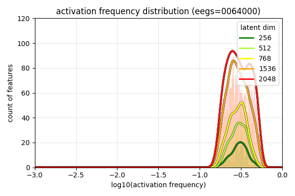
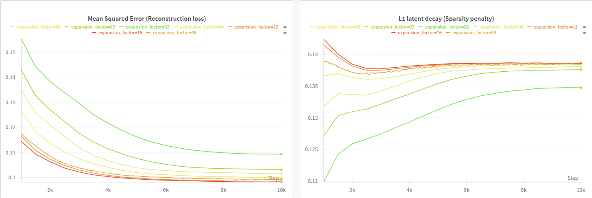

# minSAE

A library for training sparse autoencoders on EEG transformer embeddings following the recipe from [Templeton et al., 2024.](https://transformer-circuits.pub/2024/scaling-monosemanticity/)




The pipeline consists of three simple scripts:

- **`compute_embeddings.py`**: Extracting and saving intermediate activations (embeddings) from a pretrained PatchTST model on TUH EEG data.
- **`train.py`**: Training a sparse autoencoder (SAE) on the saved embeddings to learn monosemantic features.
- *(PENDING)* **`evaluate.py`**: *(PENDING)* Evaluate the SAE and precompute feature dashboard assets.


# Installation

The scripts expect a `tuhab_preprocessed` directory containing preprocessed EEG data files and a `file_lengths_map.csv`:

```
tuhab_preprocessed/
├── file_lengths_map.csv
├── aaaaaaaq_s004_t000_preprocessed.npy
└── ...
```

It also expects the gPatchTST repository downloaded and renamed to `gpatchptst`.

Clone this repository and install the required dependencies:

```bash
git clone https://github.com/TachyonGun/minSAE.git
cd minSAE
pip install wandb twdm matplotlib numpy torch
```

---

## compute_embeddings.py

### Purpose

`compute_embeddings.py` runs a pretrained PatchTST model (with optional RevIN normalization) on EEG data and captures activations at a specified transformer layer.  The activations are saved as `.npy` files for later analysis or SAE training.

### Usage

```bash
python compute_embeddings.py \
  --root_path="/path/to/tuhab_preprocessed" \
  --config_path="pretrained/config.yaml" \
  --checkpoint_path="pretrained/checkpoint.pth" \
  --cache_layer=-1 # last layer as an example\
  --max_batches=5 # Optional
```

### Arguments

- `--root_path`: Directory containing preprocessed EEG data and `file_lengths_map.csv`.
- `--config_path`: YAML config file defining `data` and `model` parameters.
- `--checkpoint_path`: Path to the model `.pth` checkpoint with keys `model_state_dict` (and optionally `revin_state_dict`).
- `--cache_layer`: Index of the encoder layer from which to capture activations (default: `-1`, the last layer).
- `--max_batches`: Maximum number of batches to process (default: all).

### Example Call

```bash
C:/Users/sierr/anaconda3/envs/mats_sae_training/python.exe "c:/Users/sierr/Desktop/Research/.../minSAEs/compute_embeddings.py" \
  --root_path="C:\\Users\\sierr\\Desktop\\Research\\...\\minSAEs\\tuhab_preprocessed" \
  --config_path="pretrained/test_pretrain_repo_tuhab_patch_10.yaml" \
  --checkpoint_path="pretrained/checkpoint_epoch_100.pth" \
  --max_batches=5
```

#### Sample Output

```
Found 2072 patients with 2569 files
Loaded existing patient splits from C:\Users\sierr\...\tuhab_preprocessed\tuh_patient_splits_seed_42.pkl
Split: train, Patients: 1450, Files: 1783
Total Sequences: 137322
... (val/test splits)
Using device: cuda
RevIN state dict missing or None; skipping RevIN load.
Loaded checkpoint from pretrained/checkpoint_epoch_100.pth
Processing 5 batches...
Batch 0 of 5
Created patches
Got prediction
Got embedding
Saved embedding batch 0000 of 5
Total time: 1.6992 seconds, ETA: 8.4960 seconds
Batch 1 of 5
...  
```

The script saves embeddings under:
```
embeddings/
└── store/
    └── l{cache_layer}/
        ├── b0000.npy
        ├── b0001.npy
        └── ...
```

---

## train.py

### Purpose

`train.py` loads saved embeddings, trains a two-layer sparse autoencoder (ReLU features + linear decoder) to reconstruct embeddings with a sparsity penalty, and logs metrics.

### Usage

```bash
python train.py \
  --num_steps 500 \
  --number_of_arrays 2 \
  --feature_dim_factor 2 \
  --lr 1e-3 \
  --lambda_sparsity 0.01 \
  --recon_weight 1.0 \
  --eval_window 1000
```

### Assumed Directory Structure

```
embeddings/
└── store/
    └── l{cache_layer}/
        ├── b0000.npy
        ├── b0001.npy
        └── ...
```

The dataset will load files in non-overlapping groups of `number_of_arrays` per sample.

### Arguments

- `--num_steps`: Total training steps (batches) to run.
- `--number_of_arrays`: How many `.npy` files to concatenate per batch.
- `--feature_dim_factor`: Multiplier of input dimension `D` to set feature dimension `F = factor * D`.
- `--lr`: Adam learning rate.
- `--lambda_sparsity`: Coefficient for sparsity penalty (λ).
- `--recon_weight`: Weight for the reconstruction MSE term.
- `--eval_window`: Steps between evaluations and logs.

### Default Example Output

With defaults (e.g. `number_of_arrays=2`, `feature_dim_factor=8` for `D=128` → `F=1024`):

```
Using device: cuda
Dataset length (#samples): 1072
Tokens per step: 245632, input_dim: 128
Feature dimension: 1024
[Step 50/10720] Processed 12281600 tokens; Avg MSE (last 50): 0.243911; Avg L1 (last 50): 0.252460; Avg active features/sample: 461.41; Window time: 10.01s; ETA: 00:35:37
[Step 100/10720] Processed 24563200 tokens; Avg MSE (last 50): 0.155892; Avg L1 (last 50): 0.164745; Avg active features/sample: 389.71; Window time: 10.24s; ETA: 00:36:15
[Step 150/10720] Processed 36844800 tokens; Avg MSE (last 50): 0.148600; Avg L1 (last 50): 0.147449; Avg active features/sample: 351.18; Window time: 10.90s; ETA: 00:38:24
```

### Training outputs

The script will save a spreadsheet `act_freqs.csv` with activation counts over the `eval_window`. You can use this to compute featue density histograms as above.

### Weights & Biases Support

If `wandb` is installed and configured, metrics (avg MSE, avg L1, avg active features, config, etc.) are logged under project **`minSAE`**.  If `wandb` import or setup fails, the script will continue without error and skip logging.

## TODO

Still need to add evaluation scripts, such as maximum activating sequences and patches (showing a window including `w` patches to either side). I have only validated that the sparse autoencoder works by evaluating L1, average non-zero features per sample, and the evolution of the feature density histogram.

Need to add an optimized dataloader and multi-GPU support, potentially run multiple parallel models at once to explore hyperparameters.

---

Happy feature mining! 